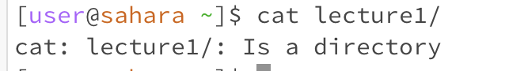
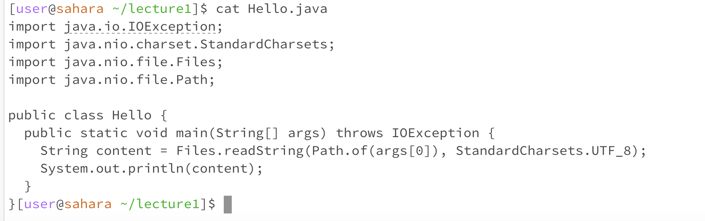

# ```cd``` no argument


Working directory: home directory

The output shows that our current working directory is still the home directory because ```cd``` with no arguments sets the users current directory to to home directory. 

This is not an error

# ```cd``` with directory argument


Working directory: lecture1

The output shows that our new working directory is lecture1 because the ```cd``` command changes the current directory to what was specificed in the argument

This is not an error

# ```cd``` with file argument


Working directory: lecture1

The output shows that the working directory was unable to change to Hello.java because Hello.java is a file and not a directory

This is an error generated by the shell, bash, because the argument was a file and you cannot change your directory to a file

# ```ls``` no argument


Working directory: home directory

The output lists out the content of the current directory which is why lecture1 is displayed as it is located within the home directory

This is not an error

# ```ls``` directory argument


Working directory: home directory

The output lists out the contents of the lecture1 directory which displays all files and subdirectories within it

This is not an error

# ```ls``` file argument


Working directory: lecture1

The output shows us the title of the file because it exists within the current working directory

This is not an error

# ```cat``` no argument


Working directory: lecture1

The output shows a new line because it is awaiting keyboard input to continue the command and will just display what the user types

This is not an error

# ```cat``` directory argument


Working directory: home directory

The output indicates that lecture1 is a directory and not a file cannot be displayed using the ```cat``` command.

This is not an error

# ```cat``` file argument


Working directory: lecture1

The output displays the content of the file Hello.java 

This is not an error


